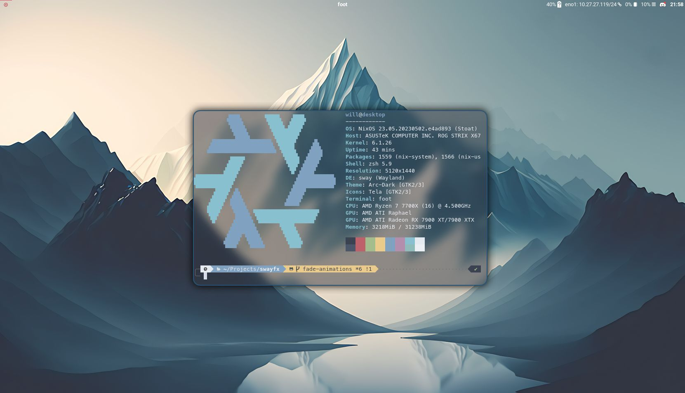

<p align="center">
    
</p>


Sway is an incredible window manager, and certainly one of the most well established wayland window managers. However, it is restricted to only include the functionality that existed in i3. This fork ditches the simple wlr_renderer, and replaces it with our fx_renderer, capable of rendering with fancy GLES2 effects. This, along with a couple of minor changes, expands sway's featureset to include the following:

+ **Blur**
+ **Anti-aliased rounded corners, borders, and titlebars**
+ **Shadows**
+ **Dim unfocused windows**
+ **Scratchpad treated as minimize**: Allows docks, or panels with a taskbar, to correctly interpret minimize / unminimize requests ([thanks to LCBCrion](https://github.com/swaywm/sway/issues/6457))
+ **nixify the repo**: Allows nixos users to easily contribute to and test this project

<p align="center">
    <a href="https://repology.org/project/swayfx/versions"></a>
    
</p>

[SwayFX is also available on the Fedora copr](https://copr.fedorainfracloud.org/coprs/swayfx/swayfx/)

[Join our Discord](https://discord.gg/qsSx397rkh)

## New Configuration Options

+ Window blur:
    - `blur enable|disable`
    - `blur_xray enable|disable`: this will set floating windows to blur based on the background, not the windows below. You probably want to set this to `disable` :)
    - `blur_passes <integer value 0 - 10>`
    - `blur_radius <integer value 0 - 10>`
    - `blur_noise <float value 0 - 1>`
    - `blur_brightness <float value 0 - 2>`
    - `blur_contrast <float value 0 - 2>`
    - `blur_saturation <float value 0 - 2>`
+ Corner radius: `corner_radius <val>`
+ Window shadows:
    - `shadows enable|disable`
    - `shadows_on_csd enable|disable` (**Note**: The shadow might not fit some windows)
    - `shadow_blur_radius <integer value 0 - 99>`
    - `shadow_color <hex color with alpha> ex, #0000007F`
    - `shadow_offset <x offset> <y offset>`
    - `shadow_inactive_color <hex color with alpha> ex, #0000007F`
+ LayerShell effects (to blur panels / notifications etc):
    - `layer_effects <layer namespace> <effects>`
    - The current layer namespaces can be shown with `swaymsg -r -t get_outputs | jq '.[0].layer_shell_surfaces | .[] | .namespace'`
    - Example: `layer_effects "waybar" blur enable; shadows enable; corner_radius 6`
      - Note: If an application uses gtk, its namespace is likely to be "gtk-layer-shell"
    - SwayIPC Example: `swaymsg layer_effects "waybar" "blur enable"` (you can only set one effect at a time through `swaymsg`)
    - Config Example:
        ```
        layer_effects "waybar" {
            blur enable;
            blur_xray enable;
            blur_ignore_transparent enable;
            shadows enable;
            use_drop_shadow enable;
            corner_radius 20;
        }
        ```
    - Available Effects:
        - `blur <enable|disable>`
        - `blur_xray <enable|disable>`
        - `blur_ignore_transparent <enable|disable>`
        - `shadows <enable|disable>`
        - `use_drop_shadow <enable|disable>`
        - `corner_radius <int>`
        - `reset`: To reset/disable all previously applied effects to the layer application
+ Dim unfocused windows:
    - `default_dim_inactive <float value 0.0 - 1.0>`
    - `for_window [CRITERIA_HERE] dim_inactive <float value 0.0 - 1.0>`
    - `dim_inactive_colors.unfocused <hex color> ex, #000000FF`
    - `dim_inactive_colors.urgent <hex color> ex, #900000FF`
+ Keep/remove separator border between titlebar and content: `titlebar_separator enable|disable`
+ Treat Scratchpad as minimized: `scratchpad_minimize enable|disable`: **we recommend keeping this setting off, as there are many kinks to iron out here**

## Roadmap

+ fade in / out animations
+ window movement animations

## Compiling From Source

### Nix

If you have Nix installed, you can build and run SwayFX easily:

```
nix build
./result/bin/sway
```

You can also bring up a development shell and follow the build instructions below, without installing all of the dependencies manually:

```
nix develop
```
### Debian
Check [INSTALL-deb.md](/INSTALL-deb.md)


### Manual Steps

Install dependencies:

* meson \*
* wlroots
* wayland
* wayland-protocols \*
* pcre2
* json-c
* pango
* cairo
* [scenefx](https://github.com/wlrfx/scenefx)
* gdk-pixbuf2 (optional: additional image formats for system tray)
* [swaybg] (optional: wallpaper)
* [scdoc] (optional: man pages) \*
* git (optional: version info) \*

_\* Compile-time dep_

Run these commands:

    meson build/
    ninja -C build/
    sudo ninja -C build/ install

On systems without logind nor seatd, you need to suid the sway binary:

    sudo chmod a+s /usr/local/bin/sway

SwayFX will drop root permissions shortly after startup.

## Contributing

SwayFX would love to receive any new features that you're willing to build! Generally, we'd like to focus on eye-candy type improvements to keep our scope appropriate. If you'd like to build something that you think may be out of that focus, please raise an issue and we can discuss whether or not it will fit within this project.

## Acknowledgements

The SwayFX team would like to first and foremost thank the maintainers and contributors of the Sway window manager. We are but a humble group of Sway enthusiasts who wanted to expand upon your creation.

We would also like to thank the talented artists in our community for contibuting the visual assets that give this project charm:
+ pkdesuwu and honchokomodo for creating the swayfx mascot: https://twitter.com/pkdesuwu/status/1664517033017368576
+ spooky_skeleton for the swayfx logo, and [Basil](https://basil.cafe) for making some fine adjustments to it

Lastly, we would like to thank you, the community, for enjoying and using window manager that we have spent so much time maintaining.

